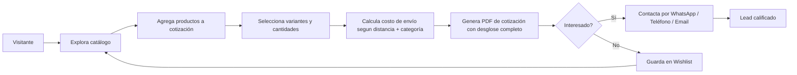
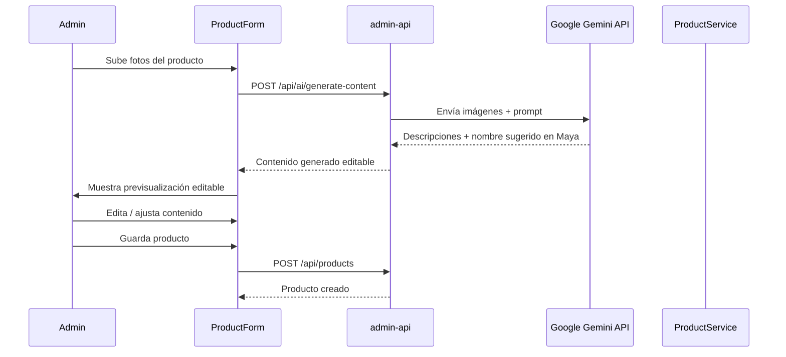

# Plan de Rebuild v2: AakArtesanias

> **Limpio.** Sin compatibilidad con v0. Código nuevo, nombres nuevos, estructura nueva.
> v0 será eliminada cuando v1 esté operativa.

---

## 1. Objetivo del Proyecto

### Declaración de Visión
**AakArtesanias** es un sitio web **generador de leads B2C** para una artesanía de muebles mexicanos hechos a mano. El sitio simula la experiencia de una tienda en línea, pero su propósito real es que el cliente arme una **cotización** que se genera en **PDF profesional** con precios, variantes, términos y costo de envío estimado. El cliente finaliza la comunicación por **WhatsApp, teléfono o correo electrónico**.

> ⚠️ **NO hay pasarela de pago, NO hay compras en línea.** El "carrito" es un **constructor de cotizaciones**. La conversión a lead ocurre cuando el cliente contacta.

### Flujo de Conversión



### Objetivos de Negocio
1. **Catálogo visual** de muebles artesanales con fotos, descripciones, variantes por categoría, dimensiones y precios
2. **Constructor de cotizaciones** con selección de variantes, cantidades y cálculo de envío
3. **Generación de PDF** con logo, tabla itemizada, subtotal/IVA/total, términos y costo de envío
4. **Calculadora de envío** basada en distancia + tabla configurable por categoría
5. **Lista de deseos (wishlist)** persistente para capturar interés
6. **Canales de contacto** prominentes: WhatsApp, teléfono, email
7. **Dashboard admin** con CRUD de productos e integración Gemini AI para generación de contenido y nombres comerciales
8. **SEO básico** y multi-idioma (ES/EN)

---

## 2. Stack Tecnológico

```
Angular 22.x (Standalone Components, Signals, zoneless)
├── TailwindCSS 4 (estilos + modo oscuro)
├── Angular Router (lazy loading)
├── @angular/localize + i18n (ES / EN)
├── Angular Signals (estado reactivo)
├── ngx-owl-carousel-o (carruseles)
├── lightgallery (galería imágenes)
├── ng-icons (iconos)
├── aos.js (animaciones scroll)
├── jsPDF + jspdf-autotable (PDF)
├── marked (Markdown a HTML)
├── Google Gemini API (generación de contenido IA)
└── Vitest (pruebas unitarias)

--- Backend admin-api (REQUERIDO) ---
├── Node.js + TypeScript
├── Hono o Express (API REST)
├── Persistencia en archivos JSON (sin ORM)
├── Google Gemini API (descripciones + nombres sugeridos)
└── Upload de imágenes
```

> **Nota:** El frontend usa `@angular/build:application` con aplicación standalone. Sin NgModules.

---

## 3. Decisiones Arquitectónicas Clave

### ADR-1: Proyecto Limpio (Greenfield)
**Contexto:** Existe una v0 con código legacy que no se reutilizará.
**Decisión:** Proyecto Angular nuevo desde cero. Nombres de archivos, variables y estructuras nuevas. Sin importar código de v0.
**Consecuencia:** Mayor velocidad de desarrollo inicial. v0 se elimina al finalizar v1.

### ADR-2: admin-api REQUERIDO (no opcional)
**Contexto:** Se necesita integración Gemini para generar descripciones y nombres comerciales de productos desde imágenes.
**Decisión:** El backend `admin-api/` es parte del proyecto. Sirve para la sesión del administrador (CRUD + Gemini + imágenes). No hay autenticación inicial.
**Consecuencia:** El frontend es static-first para el visitante pero dinámico para el admin vía API.

### ADR-3: Frontend Static-First con Puntos Dinámicos
**Contexto:** El visitante debe tener carga rápida, pero algunas funciones requieren dinamismo.
**Decisión:** Catálogo, productos, configs compilados en build (JSON). Dinámico en runtime: geolocalización (API externa), registro de cotizaciones, contacto.
**Consecuencia:** Sitio mayormente estático con puntos selectivos de dinamismo.

### ADR-4: Variantes por Categoría, no por Producto
**Contexto:** Las variantes se duplicaban en cada producto en v0.
**Decisión:** Cada categoría define sus variantes. El producto referencia índices de opciones habilitadas.
**Consecuencia:** Configuración centralizada, cambios de variantes afectan a toda una categoría.

### ADR-5: Sin Listas Separadas por Comas
**Contexto:** En v0 se usaban `variant1CommaList`, `tagComaList` con valores delimitados por coma.
**Decisión:** Arrays estructurados tipados en todos los modelos de datos. Fin del parsing manual de strings.
**Consecuencia:** Datos limpios, tipados, procesables sin parsing.

### ADR-6: Datos de Embarque Estructurados
**Contexto:** En v0 los términos de envío eran Markdown plano (`shippingTerms`).
**Decisión:** Modelo `ShippingComponent[]` con peso, dimensiones, empaque. El Markdown legacy se descarta por completo (era placeholder).
**Consecuencia:** La calculadora de envío opera con datos precisos. El admin los proveerá después del lanzamiento.

### ADR-7: Quote en lugar de Cart
**Contexto:** El "carrito" no es para comprar, sino para cotizar.
**Decisión:** `QuoteService`, ruta `/quote`. PDF es el deliverable. Wishlist y Quote son servicios separados.
**Consecuencia:** Claridad conceptual. Elimina falsas expectativas de e-commerce.

### ADR-8: i18n con Manejo de Acentos en Mayúsculas
**Contexto:** En español correcto, las mayúsculas NO llevan acento. v0 usaba `lang-text-pipe` como workaround.
**Decisión:** Almacenar textos sin acentos en mayúsculas. Se implementa una función de normalización o se usa `@angular/localize` con el texto pre-normalizado.
**Consecuencia:** Textos consistentes con reglas ortográficas españolas.

---

## 4. Modelo de Datos

### 4.1 Category con Variantes Definidas

```typescript
// category.model.ts
export interface Category {
  id: number;
  name: string;                // "Salas", "Comedores"
  slug: string;                // "salas", "comedores"
  productImage: string;        // Ruta imagen
  bgImage: string;             // Ruta fondo
  models: number;              // Cantidad de modelos
  variants: CategoryVariant[]; // Cada categoría define sus propias variantes
}

export interface CategoryVariant {
  id: string;                  // "tejido", "tamano", "color"
  label: string;               // "Tejido", "Tamaño para", "Color"
  options: CategoryVariantOption[];
}

export interface CategoryVariantOption {
  name: string;                // "Claro", "4 personas", "Un sillón"
  price: number;               // 0 si no tiene costo extra
}
```

### 4.2 Product con Datos de Embarque

```typescript
// product.model.ts
export interface Product {
  id: number;
  sku: string;
  categoryId: number;
  name: string;
  slug: string;                // Generado desde name + id

  // Imágenes
  image: string;               // Imagen principal
  imageList: string[];         // Galería

  // Variantes seleccionables (índices que referencian Category.variants)
  variantSelections: {
    variantId: string;         // Ref: "tejido"
    enabledOptionIndices: number[]; // Índices de options habilitados
  }[];

  // Precios
  originalPrice: number;
  currentPrice: number;

  // Datos de embarque (estructurados)
  shippingComponents: ShippingComponent[];

  // Metadata
  taggedSection: 'destacados' | 'nuevos' | null;
  featuredImage: string;
  featureTag: string;
  tags: string[];
  score: number;
  ratings: number;

  // Descripciones (generadas por Gemini + editables)
  shortDescription: string;
  longDescription: string;     // Markdown
  marketingPhrase: string;     // Frase que invita a comprar

  // Control
  status: 'pendiente' | 'activo' | 'suspendido' | 'almacenado';
  createdAt: string;           // ISO date
  updatedAt: string;           // ISO date
}

export interface ShippingComponent {
  name: string;                // "Sofá doble"
  netWeightKg: number;
  packagedWeightKg: number;    // Peso volumétrico
  packagedDimensionsCm: {
    width: number;
    depth: number;
    height: number;
  };
  packagingDescription: string;
}
```

### 4.3 Quote Item (Frontend + localStorage)

```typescript
// quote.model.ts
export interface QuoteItem {
  productId: number;
  productName: string;
  image: string;
  selectedVariants: {
    variantLabel: string;
    optionName: string;
    optionPrice: number;
  }[];
  qty: number;
  unitPrice: number;
  subtotal: number;            // unitPrice * qty
  shippingCost: number;        // Calculado por ShippingService
}
```

### 4.4 Tabla de Configuración de Envío

```typescript
// shipping-config.model.ts
export interface ShippingConfig {
  categoryId: number;
  categoryName: string;
  tiers: DistanceTier[];       // Ej: 0-50km: $500, 51-100km: $800
  extraUnitFactor: number;     // 0.5 = 50% por unidad extra
}

export interface DistanceTier {
  minKm: number;
  maxKm: number;
  price: number;
}
```

### 4.5 Category Name Lookup

```typescript
// category-lookup.model.ts
// Tabla de referencia para obtener categoryName desde categoryId
export const CATEGORY_NAMES: Record<number, string> = {
  1: 'Salas',
  2: 'Comedores',
  3: 'Recibidores',
  4: 'Sillones',
  5: 'Mecedoras',
  6: 'Sillas',
  7: 'Columpios',
  8: 'Pantallas',
  9: 'Marcos',
  10: 'Accesorios',
};
```

---

## 5. Mapa de Variantes por Categoría

| Categoría | Variant 1 | Variant 2 |
|-----------|-----------|-----------|
| **Salas** | Tejido: Claro, Obscuro, Combinado | *(none)* |
| **Comedores** | Tamaño: 4pers, 6pers, 8pers | Tejido: Claro, Obscuro, Combinado |
| **Recibidores** | Tamaño: Un sillón, Dos sillones | Tejido: Claro, Obscuro, Combinado |
| **Sillones** | Tejido: Claro, Obscuro, Combinado | *(none)* |
| **Mecedoras** | Tejido: Claro, Obscuro, Combinado | *(none)* |
| **Sillas** | Tejido: Claro, Obscuro, Combinado | *(none)* |
| **Columpios** | Tejido: Claro, Obscuro, Combinado | *(none)* |
| **Pantallas** | *(none)* | *(none)* |
| **Marcos** | *(none)* | *(none)* |
| **Accesorios** | *(none)* | *(none)* |

Cada opción puede tener un **price override** (precio adicional por seleccionar esa variante).

---

## 6. Estructura de Directorios

```
aakartesanias/
├── src/
│   ├── app/
│   │   ├── core/                        # Singleton services, modelos, datos
│   │   │   ├── services/
│   │   │   │   ├── product.service.ts
│   │   │   │   ├── category.service.ts
│   │   │   │   ├── quote.service.ts     # Constructor de cotizaciones
│   │   │   │   ├── wishlist.service.ts
│   │   │   │   ├── shipping.service.ts  # Calculadora de envío
│   │   │   │   ├── pdf.service.ts       # Generación PDF
│   │   │   │   ├── ai-content.service.ts # Integración Gemini API
│   │   │   │   ├── markdown.service.ts
│   │   │   │   ├── theme.service.ts
│   │   │   │   └── session.service.ts   # UUID de sesión
│   │   │   ├── models/
│   │   │   │   ├── product.model.ts
│   │   │   │   ├── category.model.ts
│   │   │   │   ├── quote.model.ts
│   │   │   │   ├── shipping-config.model.ts
│   │   │   │   └── category-lookup.model.ts
│   │   │   └── data/
│   │   │       ├── products.json
│   │   │       ├── categories.json      # Incluye variantes por categoría
│   │   │       └── shipping-config.json # Tabla de tarifas
│   │   │
│   │   ├── shared/                      # Componentes reutilizables
│   │   │   ├── navbar/
│   │   │   ├── footer/
│   │   │   ├── product-card/
│   │   │   ├── rating-stars/
│   │   │   ├── quick-actions/
│   │   │   ├── scroll-to-top/
│   │   │   ├── theme-switcher/
│   │   │   ├── image-gallery/
│   │   │   ├── inc-dec/
│   │   │   ├── variant-selector/        # Selector dinámico de variantes
│   │   │   ├── shipping-calculator/     # Calculadora de envío embebible
│   │   │   └── contact-bar/
│   │   │
│   │   ├── features/                    # Páginas (lazy loaded)
│   │   │   ├── home/                    # Ruta: /
│   │   │   ├── shop/                    # Ruta: /shop
│   │   │   ├── category/               # Ruta: /category/:slug
│   │   │   ├── product-detail/          # Ruta: /product/:slug
│   │   │   ├── quote/                   # Ruta: /quote
│   │   │   └── shipping/               # Ruta: /shipping
│   │   │
│   │   ├── admin/                       # Dashboard (nuevo, desde cero)
│   │   │   ├── dashboard/              # Tabla con filtros
│   │   │   ├── product-form/           # Formulario CRUD + Gemini
│   │   │   ├── catalog-workspace/      # Layout split view
│   │   │   ├── ai-content-generator/   # Panel de generación IA
│   │   │   └── shipping-config/        # Admin de tarifas de envío
│   │   │
│   │   ├── sections/                    # Secciones del Home
│   │   │   ├── hero/
│   │   │   ├── featured-products/
│   │   │   ├── new-products/
│   │   │   ├── product-category/
│   │   │   └── why-us/
│   │   │
│   │   ├── app.component.ts
│   │   ├── app.component.html
│   │   ├── app.config.ts
│   │   └── app.routes.ts
│   │
│   ├── assets/img/products/
│   ├── assets/svg/
│   ├── locale/
│   ├── styles.css
│   └── main.ts
│
├── config/                              # Archivos de configuración
│   ├── contact.config.json              # Placeholders de contacto
│   └── shipping-config.json             # Tarifas de envío de ejemplo
│
├── admin-api/                           # Backend REQUERIDO
│   ├── src/
│   │   ├── index.ts
│   │   ├── routes/
│   │   │   ├── products.ts
│   │   │   ├── categories.ts
│   │   │   ├── ai-content.ts            # Gemini integration
│   │   │   └── images.ts               # Upload handler
│   │   └── services/
│   │       └── gemini.service.ts
│   ├── .env.example
│   ├── package.json
│   └── tsconfig.json
│
├── utilities/
│   └── prebuild.mjs                     # Script prebuild
├── angular.json
├── package.json
├── vercel.json
└── README.md
```

---

## 7. Diagrama de Arquitectura

```mermaid
flowchart TB
    subgraph Core_Services
        PS[ProductService]
        CS[CategoryService]
        QS[QuoteService]
        WS[WishlistService]
        SS[ShippingService]
        PDF[PdfService]
        AI[GeminiAIContentService]
        SES[SessionService]
    end

    subgraph Data_Store
        JSON_P[products.json]
        JSON_C[categories.json con variantes]
        JSON_S[shipping-config.json]
        LS[(localStorage)]
    end

    subgraph Shared_Components
        NC[Navbar]
        FC[Footer]
        PC[ProductCard]
        QA[QuickActions]
        VS[VariantSelector]
        SC[ShippingCalculator]
        CB[ContactBar]
    end

    subgraph Pages
        HOME[Home /]
        SHOP[Shop /shop]
        CAT[Category /category/:slug]
        PD[ProductDetail /product/:slug]
        QUOTE[Quote /quote]
        SHIP[Shipping /shipping]
    end

    subgraph Admin_Panel
        DASH[CatalogDashboard]
        PF[ProductForm]
        AIG[GeminiContentGenerator]
        SCONF[ShippingConfigAdmin]
    end

    subgraph Backend_API
        API[admin-api Express/Hono]
        GEM[Google Gemini API]
        UPLOAD[Image Upload]
    end

    %% Data flows
    PS --> JSON_P
    CS --> JSON_C
    SS --> JSON_S
    QS --> LS
    WS --> LS
    SES --> LS

    %% Core to Pages
    PS --> HOME & SHOP & CAT & PD
    CS --> HOME & CAT & PD
    SS --> PD & QUOTE
    QS --> QUOTE & PD
    WS --> QA & PD & NC

    %% Admin flows
    PF --> API
    API --> PS
    PF --> AI
    AI --> GEM
    AIG --> AI
    SCONF --> SS

    %% Shared components
    PD --> VS & SC & QA
    QUOTE --> PDF & CB
    HOME & SHOP & CAT & PD & QUOTE & SHIP --> NC & FC
```



---

## 8. Estrategia de Datos Iniciales

### 8.1 Migración desde v0 (Solo lo esencial)

De la v0 se migra **únicamente**:
- **Imágenes** de productos (carpeta `assets/img/products/`)
- **Categorías** (estructura base con nombres e imágenes)
- **Productos**: solo `id`, `categoryId`, `image`, `imageList` — todo lo demás se inicializa como `null` o placeholder

### 8.2 Datos Placeholder (Claramente Marcados)

Los siguientes archivos contienen **datos de ejemplo** que el admin reemplazará:

| Archivo | Propósito | Estado |
|---------|-----------|--------|
| [`config/contact.config.json`](config/contact.config.json) | Teléfono, WhatsApp, Email de contacto | Placeholder |
| [`config/shipping-config.json`](config/shipping-config.json) | Tarifas de envío por distancia + categoría | Datos inventados de ejemplo |
| `products.json` → `currentPrice`, `originalPrice` | Precios de productos | Placeholder |
| `products.json` → `shippingComponents` | Datos de embarque | Vacío inicialmente |

### 8.3 Regeneración con Gemini

El flujo esperado es:
1. Admin migra imágenes y categorías
2. Admin usa Gemini Content Generator para generar descripciones + nombre comercial en Maya
3. Admin ingresa precios manualmente
4. Admin configura tarifas de envío después del lanzamiento

---

## 9. Integración Gemini AI (Admin Flow)

### 9.1 Flujo de Creación de Producto con IA



### 9.2 Prompt para Gemini
```
Eres un experto en descripción de productos artesanales mexicanos.
Basado en las siguientes imágenes de un mueble artesanal, genera:

1. suggestedName (maya): Nombre comercial en lengua maya que describa
   la esencia del producto. Ej: "K'aay" cantar, "Óolal" deseo.

2. shortDescription (max 2 oraciones): Descripción corta y atractiva
   destacando materiales, diseño y uso ideal.

3. longDescription (Markdown): Descripción detallada incluyendo:
   - Materiales y técnicas artesanales
   - Colores y acabados disponibles
   - Opciones de personalización
   - Estilo y ambiente recomendado

4. marketingPhrase (1 frase): Frase corta que invite a comprar.

Responde en español con un tono cálido, auténtico y profesional.
```

---

## 10. Calculadora de Envío

### 10.1 Fórmula de Cálculo
```
costoEnvio = tarifaBase(categoria, distancia) +
             (unidades - 1) * tarifaBase * factorUnidadExtra
```

Donde:
- `tarifaBase`: Se obtiene de `shipping-config.json` según categoría y rango de distancia
- `factorUnidadExtra`: 0.5 por defecto (50% por cada unidad adicional del mismo producto)

### 10.2 Interfaz de Usuario
En la página de cotización `/quote`, el usuario puede:
1. Ingresar **código postal de envío** o **distancia en km**
2. Opcional: geolocalización vía API externa (OpenStreetMap / Google Maps)
3. La calculadora muestra el desglose del costo de envío
4. El PDF final incluye: subtotal + IVA + envío = total

---

## 11. Plan de Ejecución

### Fase 1: Setup del Proyecto
- [ ] Crear proyecto Angular 22 en `../AakArtesanias` (nuevo directorio)
- [ ] Configurar TailwindCSS 4 con paleta de colores
- [ ] Configurar i18n (ES default, EN secondary)
- [ ] Configurar `.editorconfig`, `.gitignore`
- [ ] Copiar assets (imágenes, SVGs, fuentes) desde v0

### Fase 2: Modelos y Datos Base
- [ ] Definir modelos: `Category`, `Product`, `QuoteItem`, `ShippingConfig`, `CategoryLookup`
- [ ] Crear `categories.json` con variantes por categoría
- [ ] Crear script de migración: extraer solo imágenes + categorías de v0
- [ ] Crear `config/contact.config.json` con placeholders
- [ ] Crear `config/shipping-config.json` con datos de ejemplo
- [ ] Crear `products.json` inicial (solo estructura base con placeholders)

### Fase 3: Core Services (Frontend)
- [ ] CategoryService (signal)
- [ ] ProductService (signal, CRUD, filtros)
- [ ] QuoteService (signal + localStorage)
- [ ] SessionService (UUID + localStorage)
- [ ] WishlistService (signal + localStorage)
- [ ] ShippingService (cálculo + geolocalización opcional)
- [ ] PdfService (jsPDF)
- [ ] MarkdownService
- [ ] ThemeService

### Fase 4: Shared Components
- [ ] Navbar, Footer, ProductCard, RatingStars
- [ ] QuickActions (wishlist toggle)
- [ ] VariantSelector (dinámico según categoría)
- [ ] ShippingCalculator (embebible, con geolocalización opcional)
- [ ] ContactBar (WhatsApp flotante)
- [ ] ImageGallery, ScrollToTop, ThemeSwitcher, IncDec

### Fase 5: Páginas Públicas
- [ ] Home (hero, categories, featured, new, why-us)
- [ ] Shop (grid de productos)
- [ ] Category (filtrados por slug)
- [ ] ProductDetail (galería, variantes, shipping, add to quote)
- [ ] Quote (lista, shipping calc, generar PDF)
- [ ] Shipping (información general)

### Fase 6: PDF Generator
- [ ] Implementar PdfService con jsPDF + jspdf-autotable
- [ ] Diseño con logo, colores corporativos, tabla itemizada
- [ ] Desglose: subtotal + IVA + costo de envío + gran total
- [ ] Términos y condiciones
- [ ] Preview en nueva pestaña + descarga directa

### Fase 7: Admin Panel (Frontend + Backend)
- [ ] Setup admin-api (Express/Hono, persistencia JSON)
- [ ] CRUD de productos API
- [ ] Gemini AI content generation (descripciones + nombre sugerido)
- [ ] Image upload handler
- [ ] CatalogWorkspace (split view dashboard + form)
- [ ] ProductForm con integración Gemini
- [ ] ShippingConfigAdmin (tabla de tarifas)
- [ ] `.env.example` con GEMINI_API_KEY

### Fase 8: Build y Polish
- [ ] Script `utilities/prebuild.mjs`
- [ ] SEO tags
- [ ] Pruebas unitarias (Vitest)
- [ ] Build de producción
- [ ] Configurar Vercel deploy
- [ ] README con instrucciones de workflow

---

## 12. Mapa de Rutas del Frontend

```typescript
export const routes: Routes = [
  // Páginas públicas (static-first)
  { path: '', loadComponent: () => import('./features/home/home.component') },
  { path: 'shop', loadComponent: () => import('./features/shop/shop.component') },
  { path: 'category/:slug', loadComponent: () => import('./features/category/category.component') },
  { path: 'product/:slug', loadComponent: () => import('./features/product-detail/product-detail.component') },
  { path: 'quote', loadComponent: () => import('./features/quote/quote.component') },
  { path: 'shipping', loadComponent: () => import('./features/shipping/shipping.component') },

  // Admin (acceso libre por ahora)
  { path: 'admin', loadComponent: () => import('./admin/catalog-workspace/catalog-workspace.component') },
  { path: 'admin/shipping', loadComponent: () => import('./admin/shipping-config/shipping-config.component') },

  // Fallback
  { path: '**', redirectTo: '' }
];
```

---

## 13. i18n y Manejo de Acentos

### Problema
En español correcto, las mayúsculas NO llevan acento. Ej:
- ❌ "Óolal - Deseo" (v0)
- ✅ "Oolal - Deseo"

### Solución Propuesta
Usar `@angular/localize` estándar con un helper de normalización:

```typescript
// utils/normalize.ts
export function normalizeUppercase(text: string): string {
  // Elimina acentos de mayúsculas pero mantiene acentos en minúsculas
  return text.replace(/([A-ZÁÉÍÓÚÜ])/g, (match) =>
    match.normalize('NFD').replace(/[\u0300-\u036f]/g, '')
  );
}
```

Los textos en `locale/` se almacenan sin acentos en mayúsculas. El helper se aplica en componentes que muestren texto en mayúsculas vía CSS (`text-transform: uppercase`).
