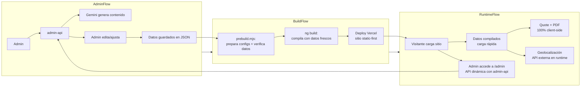
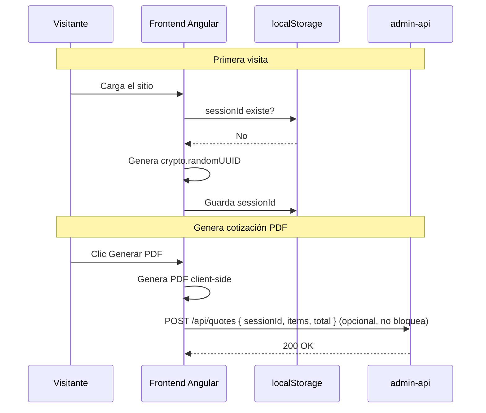

# Arquitectura Detallada v2: AakArtesanias

## Resumen Ejecutivo

AakArtesanias se construye desde cero como proyecto Angular 22 greenfield. Sin importar código de v0.

| Principio | Descripción |
|-----------|-------------|
| **Greenfield** | Proyecto nuevo, nombres nuevos, estructura nueva. v0 se elimina al finalizar. |
| **Static-first** | Catálogo, productos, configs compilados en build para el visitante. |
| **Admin dinámico** | Admin-api con Express/Hono para CRUD + Gemini + imágenes. |
| **Mobile-first** | Diseño mobile-first con TailwindCSS 4. |
| **Signals-only** | Estado reactivo con Angular Signals. Sin RxJS para estado local. Zero zone.js. |
| **Sin commas** | Datos estructurados siempre. Sin listas separadas por coma. |

---

## 1. Decisiones de Arquitectura Refinadas

### 1.1 Greenfield Total
- **NO** se reutiliza código de v0 (excepto assets: imágenes, SVGs, fuentes)
- Nombres de archivos, variables, componentes: todo nuevo
- v0 (`AakApp/`) se eliminará cuando v1 esté operativa

### 1.2 admin-api: Requerido
- Backend Express/Hono **obligatorio** para integración Gemini
- Persistencia en archivos JSON (sin ORM, sin DB)
- Sirve CRUD para admin + generación de contenido IA
- API key de Gemini en `.env`
- Sin autenticación por ahora

### 1.3 Static-First + Puntos Dinámicos

| Capa | Visitante | Admin |
|------|-----------|-------|
| Catálogo JSON | Compilado en build | CRUD vía API |
| Productos | Compilado en build | CRUD vía API |
| Variantes | Compilado en build | Gestionado en admin |
| Quote/Cotización | localStorage + signals | N/A |
| PDF | 100% client-side (jsPDF) | N/A |
| Geolocalización | API externa en runtime | N/A |
| Gemini AI | N/A | API vía admin-api |
| Wishlist | localStorage | N/A |
| Contacto | Config compilado en build | Config editable |
| i18n | Build-time | Build-time |
| Session tracking | UUID en localStorage + POST opcional | Visualización |

### 1.4 Datos: Solo Imágenes + Categorías desde v0

```
De v0 se migra:
├── assets/img/products/    (carpeta completa)
├── assets/img/categories/  (carpeta completa)
├── assets/img/home-v1/     (imágenes de categorías)
├── assets/svg/             (iconos)
├── assets/fonts/           (tipografías)
└── categories.json         (solo estructura base: id, name, images, models)

NO se migra:
├── products.json           (se crea nuevo, solo placeholders)
├── products2.json          (se descarta)
├── shippingTerms           (era placeholder, se descarta)
├── variant*CommaList       (se descarta, se usa nuevo formato)
└── Código fuente           (todo nuevo)
```

### 1.5 Estructuras de Datos Limpias

**Antes (v0, se descarta):**
```json
"variant1Label": "Tejido",
"variant1CommaList": "Claro/0, Obscuro/1100, Combinado/780",
"variant2Label": "",
"variant2CommaList": "",
"tagComaList": "premium,nuevo",
"imageCommaList": "img1.png,img2.png",
"shippingTerms": "### texto markdown con datos mezclados..."
```

**Después (v1):**
```json
"variantSelections": [
  { "variantId": "tejido", "enabledOptionIndices": [0, 1, 2] }
],
"tags": ["premium", "nuevo"],
"imageList": ["img1.png", "img2.png"],
"shippingComponents": [
  {
    "name": "Sofá doble",
    "netWeightKg": 35,
    "packagedWeightKg": 55,
    "packagedDimensionsCm": { "width": 155, "depth": 95, "height": 90 },
    "packagingDescription": "Tarima base + embalaje alta resistencia"
  }
]
```

---

## 2. Estructura del Proyecto

```
AakArtesanias/                          # NUEVO directorio (al mismo nivel que AakApp/)
├── src/
│   ├── app/
│   │   ├── core/
│   │   │   ├── services/
│   │   │   │   ├── product.service.ts
│   │   │   │   ├── category.service.ts
│   │   │   │   ├── quote.service.ts
│   │   │   │   ├── wishlist.service.ts
│   │   │   │   ├── shipping.service.ts
│   │   │   │   ├── pdf.service.ts
│   │   │   │   ├── markdown.service.ts
│   │   │   │   ├── theme.service.ts
│   │   │   │   └── session.service.ts
│   │   │   └── data/                   # JSON compilados en build
│   │   │       ├── products.json
│   │   │       ├── categories.json     # Con variantes por categoría
│   │   │       └── shipping-config.json
│   │   ├── models/
│   │   │   ├── product.model.ts
│   │   │   ├── category.model.ts
│   │   │   ├── quote.model.ts
│   │   │   ├── shipping-config.model.ts
│   │   │   └── category-lookup.model.ts
│   │   ├── shared/                     # Componentes reutilizables
│   │   ├── features/                   # Páginas lazy loaded
│   │   ├── admin/                      # Dashboard (nuevo, desde cero)
│   │   ├── sections/                   # Secciones del Home
│   │   ├── app.component.ts
│   │   ├── app.component.html
│   │   ├── app.config.ts
│   │   └── app.routes.ts
│   ├── assets/img/products/            # Migrado desde v0
│   ├── assets/svg/                     # Migrado desde v0
│   ├── locale/                         # ES / EN
│   ├── styles.css
│   └── main.ts
│
├── config/                             # Archivos de configuración
│   ├── contact.config.json             # Placeholders de contacto
│   └── shipping-config.json            # Tarifas de envío de ejemplo
│
├── admin-api/                          # Backend REQUERIDO
│   ├── src/
│   │   ├── index.ts                    # Entry point Express/Hono
│   │   ├── routes/
│   │   │   ├── products.ts
│   │   │   ├── categories.ts
│   │   │   ├── ai-content.ts           # Gemini integration
│   │   │   └── images.ts               # Upload handler
│   │   └── services/
│   │       └── gemini.service.ts
│   ├── data/                           # JSON files persistidos por admin-api
│   │   ├── products.json               # Misma estructura que src/app/core/data/
│   │   └── categories.json
│   ├── .env.example                    # GEMINI_API_KEY=...
│   ├── package.json
│   └── tsconfig.json
│
├── utilities/
│   ├── prebuild.mjs                    # Script prebuild
│   └── migrate-from-v0.mjs             # Script de migración (solo imágenes + categorías)
├── angular.json
├── package.json
├── vercel.json
├── .editorconfig
├── .gitignore
└── README.md
```

---

## 3. Pipeline de Datos y Build

### 3.1 Flujo Completo



### 3.2 Prebuild Script

El script `utilities/prebuild.mjs` se ejecuta antes de `ng build`:

1. Lee archivos de `config/`:
   - `contact.config.json` → genera archivo TypeScript
   - `shipping-config.json` → verifica estructura
2. Verifica integridad de datos JSON de productos
3. Si `admin-api/data/products.json` es más reciente que `src/app/core/data/products.json`, lo copia

### 3.3 Script de Migración (v0 → v1)

`utilities/migrate-from-v0.mjs` ejecutable una sola vez:

1. Lee `categories.json` de v0
2. Lee `products.json` de v0
3. **Extrae solo**: id, categoryId, categoryName, image, imageCommaList → imageList
4. **Descarta**: variant*CommaList, tagComaList, shippingTerms, precios
5. Genera `categories.json` nuevo con estructura de variantes vacía
6. Genera `products.json` nuevo con placeholders
7. Copia assets (imágenes, SVGs, fuentes)

---

## 4. Diseño Mobile-First

### 4.1 Breakpoints
```css
/* TailwindCSS 4 - mobile-first */
/* sm: 640px  → Tablet vertical */
/* md: 768px  → Tablet horizontal */
/* lg: 1024px → Desktop */
/* xl: 1280px → Desktop HD */
```

### 4.2 Reglas de Diseño
1. **Mobile es el default** — Todo componente se diseña primero para <640px
2. **Escalamiento progresivo** — Se usa `sm:`, `md:`, `lg:` para escalar, nunca `max-`
3. **Touch targets ≥ 44px** — Botones, enlaces, iconos interactivos
4. **Navegación responsive** — Menú hamburguesa en móvil, navbar horizontal en desktop
5. **Grid adaptativo** — 1 columna móvil → 2 tablet → 3-4 desktop
6. **Imágenes responsivas** — `max-width: 100%` + lazy loading

### 4.3 Comportamiento por Componente
| Componente | Mobile <640px | Tablet 640-1023px | Desktop >=1024px |
|------------|---------------|-------------------|------------------|
| Navbar | Menú hamburguesa + logo | Hamburguesa + acceso directo | Horizontal completo |
| Hero | 1 slide, texto grande | 1 slide balanceado | Carrusel + overlays |
| Product Grid | 1 columna | 2 columnas | 3-4 columnas |
| Product Detail | Stack vertical | 2 columnas simétricas | 2 columnas + sidebar |
| Quote builder | Full width | 2 columnas items/resumen | 2 columnas + resumen fijo |
| Footer | Stack vertical | 2 columnas | 3-4 columnas |
| ContactBar | Barra fixed inferior | Barra fixed inferior | Flotante lateral derecho |
| Admin | Full width | Full width con sidebar | Sidebar + main content |

---

## 5. Sesión de Visitante y Tracking

### 5.1 Concepto
Cada visitante anónimo recibe un **UUID de sesión** persistido en localStorage. Cuando genera una cotización PDF, opcionalmente se envía al backend para tracking futuro.

### 5.2 Flujo


### 5.3 Modelo de Datos
```typescript
// session.model.ts
export interface QuoteRecord {
  id: string;
  sessionId: string;
  items: QuoteRecordItem[];
  subtotal: number;
  iva: number;
  total: number;
  createdAt: string;        // ISO date
}

export interface QuoteRecordItem {
  productId: number;
  productName: string;
  qty: number;
  unitPrice: number;
  selectedVariants: { label: string; option: string }[];
}
```

---

## 6. API Backend (admin-api)

### 6.1 Endpoints
```
# Admin CRUD
GET    /api/products                  # Lista productos
GET    /api/products/:id              # Detalle producto
POST   /api/products                  # Crear producto
PUT    /api/products/:id              # Actualizar producto
DELETE /api/products/:id              # Eliminar producto

GET    /api/categories                # Lista categorías (con variantes)
PUT    /api/categories/:id            # Actualizar variantes de categoría

POST   /api/images/upload             # Subir imagen

POST   /api/ai/generate-content       # Gemini: generar descripciones + nombre sugerido

# Tracking (opcional)
POST   /api/quotes                    # Registrar cotización generada
```

> Sin autenticación por ahora. Sin ORM. Persistencia en archivos JSON en `admin-api/data/`.

### 6.2 Gemini Integration
```typescript
// gemini.service.ts
POST /api/ai/generate-content
Body: { images: string[], categoryId: number }
Response: {
  suggestedName: string,       // Nombre en Maya
  shortDescription: string,
  longDescription: string,     // Markdown
  marketingPhrase: string
}
```

---

## 7. Mapa de Rutas del Frontend

```typescript
export const routes: Routes = [
  // Páginas públicas (static-first)
  { path: '', loadComponent: () => import('./features/home/home.component') },
  { path: 'shop', loadComponent: () => import('./features/shop/shop.component') },
  { path: 'category/:slug', loadComponent: () => import('./features/category/category.component') },
  { path: 'product/:slug', loadComponent: () => import('./features/product-detail/product-detail.component') },
  { path: 'quote', loadComponent: () => import('./features/quote/quote.component') },
  { path: 'shipping', loadComponent: () => import('./features/shipping/shipping.component') },

  // Admin (acceso libre por ahora)
  { path: 'admin', loadComponent: () => import('./admin/catalog-workspace/catalog-workspace.component') },
  { path: 'admin/shipping', loadComponent: () => import('./admin/shipping-config/shipping-config.component') },

  // Fallback
  { path: '**', redirectTo: '' }
];
```

---

## 8. Estrategia de Datos Placeholder

Todos los datos de ejemplo están claramente marcados como placeholder:

### 8.1 `config/contact.config.json`
```json
{
  "whatsapp": {
    "number": "5219999999999",
    "message": "Hola, quiero información sobre sus productos artesanales."
  },
  "phone": "+52 999 999 99 99",
  "email": "contacto@aakartesanias.com",
  "businessHours": "Lun - Sab: 9:00 - 18:00"
}
```
> **PLACEHOLDER** - Reemplazar con datos reales antes de producción.

### 8.2 `config/shipping-config.json`
```json
{
  "categories": [
    {
      "categoryId": 1,
      "categoryName": "Salas",
      "tiers": [
        { "minKm": 0, "maxKm": 50, "price": 500 },
        { "minKm": 51, "maxKm": 100, "price": 800 },
        { "minKm": 101, "maxKm": 200, "price": 1200 },
        { "minKm": 201, "maxKm": 500, "price": 2000 }
      ],
      "extraUnitFactor": 0.5
    }
  ],
  "defaultExtraUnitFactor": 0.5
}
```
> **DATOS DE EJEMPLO** - Reemplazar con tarifas reales antes de producción.

### 8.3 En `products.json`
```json
{
  "id": 1,
  "categoryId": 1,
  "name": null,                  // Será sugerido por Gemini
  "slug": "producto-1",          // Placeholder
  "image": "assets/img/products/01-salas/001.png",   // Migrado de v0
  "imageList": [],
  "variantSelections": [],
  "originalPrice": 0,            // Placeholder
  "currentPrice": 0,             // Placeholder
  "shortDescription": "",        // Se generará con Gemini
  "longDescription": "",         // Se generará con Gemini
  "marketingPhrase": "",         // Se generará con Gemini
  "shippingComponents": [],      // Vacío, lo proveerá el admin
  "status": "pendiente",
  "createdAt": "2025-01-01T00:00:00.000Z",
  "updatedAt": "2025-01-01T00:00:00.000Z"
}
```

---

## 9. i18n y Normalización de Mayúsculas

### 9.1 Problema
En español correcto, las mayúsculas NO llevan acento:
- ❌ "Óolal" (incorrecto)
- ✅ "Oolal" (correcto)

### 9.2 Solución: Helper de Normalización
Se implementa un utility function que se aplica donde sea necesario:

```typescript
// core/utils/text-utils.ts
const ACCENT_MAP: Record<string, string> = {
  'Á': 'A', 'É': 'E', 'Í': 'I', 'Ó': 'O', 'Ú': 'U',
  'Ü': 'U', 'á': 'á', 'é': 'é', 'í': 'í', 'ó': 'ó',
  'ú': 'ú', 'ü': 'ü',
};

export function removeAccentUppercase(text: string): string {
  return text.replace(/[A-ZÁÉÍÓÚÜ]/g, (char) => ACCENT_MAP[char] || char);
}
```

### 9.3 Uso
- Los textos se almacenan CON acentos (forma natural)
- Al mostrarse en contextos de mayúscula sostenida (vía CSS `text-transform: uppercase`), el helper normaliza
- `@angular/localize` maneja la traducción ES/EN

---

## 10. Pros y Contras del Enfoque

### ✅ Ventajas
1. **Código limpio** — Sin deuda técnica de v0
2. **Rapidez de desarrollo** — Decisiones ya tomadas, sin necesidad de compatibilidad
3. **Estructuras modernas** — Sin parsing de strings, datos tipados
4. **Admin robusto** — API backend dedicada para gestión + IA
5. **Static-first** — Velocidad para el visitante
6. **Flexibilidad** — Geolocalización dinámica, contacto configurable

### ⚠️ Desventajas y Mitigaciones
| Desventaja | Mitigación |
|------------|------------|
| Los cambios no son en tiempo real | Build manual ~2 min. Aceptable para catálogo artesanal. |
| No hay stock en tiempo real | Los productos artesanales no tienen stock dinámico; se confirma por WhatsApp. |
| Admin necesita trigger manual | Workflow simple: prebuild → ng build → deploy. |
| Placeholders deben reemplazarse | Claramente marcados en archivos de configuración. |

---

## 11. Plan de Implementación Detallado

### Fase 1: Setup del Proyecto
- [ ] Crear proyecto Angular 22 (zoneless, standalone) en `../AakArtesanias`
- [ ] Configurar TailwindCSS 4 con paleta de colores
- [ ] Configurar i18n (ES default, EN secondary)
- [ ] Configurar `.editorconfig`, `.gitignore`
- [ ] Copiar assets (imágenes, SVGs, fuentes) desde v0

### Fase 2: Modelos y Migración de Datos
- [ ] Definir modelos: `Category`, `Product`, `QuoteItem`, `ShippingConfig`, `CategoryLookup`
- [ ] Crear `categories.json` con variantes por categoría (10 categorías)
- [ ] Crear script `utilities/migrate-from-v0.mjs`
- [ ] Ejecutar migración: copiar imágenes + estructura base de productos
- [ ] Crear `config/contact.config.json` con placeholders
- [ ] Crear `config/shipping-config.json` con datos de ejemplo
- [ ] Crear `products.json` inicial con placeholders

### Fase 3: Core Services (Frontend)
- [ ] `CategoryService` (signal)
- [ ] `ProductService` (signal, CRUD, filtros por status)
- [ ] `QuoteService` (signal + localStorage, items, subtotal, IVA, total)
- [ ] `SessionService` (UUID + localStorage)
- [ ] `WishlistService` (signal + localStorage)
- [ ] `ShippingService` (cálculo por categoría + distancia)
- [ ] `PdfService` (jsPDF + jspdf-autotable)
- [ ] `MarkdownService` (marked)
- [ ] `ThemeService` (dark/light mode)
- [ ] Utility: `text-utils.ts` (normalización de acentos)

### Fase 4: Shared Components
- [ ] **Navbar** (logo, menú, quote count, wishlist count, theme toggle)
- [ ] **Footer** (contacto desde config)
- [ ] **ProductCard** (imagen, nombre, precio, rating)
- [ ] **RatingStars** (visualización de score)
- [ ] **QuickActions** (wishlist toggle + add to quote)
- [ ] **VariantSelector** (dinámico según categoría)
- [ ] **ShippingCalculator** (input distancia/CP, cálculo)
- [ ] **ContactBar** (WhatsApp flotante, datos desde config)
- [ ] **ImageGallery** (lightgallery)
- [ ] **ScrollToTop**
- [ ] **ThemeSwitcher**
- [ ] **IncDec** (increment/decrement quantity)

### Fase 5: Páginas Públicas
- [ ] **Home** (hero carrusel, categorías, featured, nuevos, why-us)
- [ ] **Shop** (grid de todos los productos)
- [ ] **Category** (productos por slug con header visual)
- [ ] **ProductDetail** (galería, variantes, shipping calc, add to quote)
- [ ] **Quote** (lista items, variantes, shipping calc, generar PDF)
- [ ] **Shipping** (información general de métodos de envío)

### Fase 6: PDF Generator
- [ ] Implementar `PdfService` con jsPDF
- [ ] Diseño: logo, colores corporativos, tabla itemizada
- [ ] Incluir variantes seleccionadas por producto
- [ ] Desglose: subtotal + IVA + costo de envío + gran total
- [ ] Términos y condiciones
- [ ] Preview en nueva pestaña + descarga directa

### Fase 7: Admin Panel (Frontend + Backend)
- [ ] Setup `admin-api/` con Express/Hono
- [ ] CRUD de productos API (persistencia JSON)
- [ ] Gemini content generation API
- [ ] Image upload handler
- [ ] `.env.example` con `GEMINI_API_KEY`
- [ ] **CatalogWorkspace** (split view: tabla + formulario)
- [ ] **Dashboard** (tabla con filtros por status)
- [ ] **ProductForm** (campos, subida de imágenes, botón "Generar con Gemini")
- [ ] **GeminiContentGenerator** (panel integrado en formulario)
- [ ] **ShippingConfigAdmin** (tabla de tarifas por categoría)

### Fase 8: Build, Deploy y Documentación
- [ ] Script `utilities/prebuild.mjs`
- [ ] SEO tags (title, description, Open Graph)
- [ ] Pruebas unitarias con Vitest (servicios críticos)
- [ ] Build de producción
- [ ] Configurar Vercel deploy
- [ ] README con instrucciones de workflow completo

---

## 12. ADRs (Arquitecture Decision Records)

### ADR-1: Greenfield Project
**Contexto:** Existe v0 con código legacy.
**Decisión:** Proyecto Angular 22 nuevo. Sin reutilizar código fuente de v0.
**Consecuencia:** Código limpio, decisiones frescas, sin deuda técnica.

### ADR-2: admin-api Requerido
**Contexto:** Se necesita integración Gemini y gestión de contenido.
**Decisión:** Backend Express/Hono obligatorio, persiste en JSON, sin ORM.
**Consecuencia:** Admin tiene API para CRUD + IA. Visitante no depende del backend.

### ADR-3: Variantes por Categoría
**Contexto:** Las variantes se duplicaban en cada producto (v0 con comma-separated).
**Decisión:** Variantes definidas en `Category.variants[]`. Producto referencia índices.
**Consecuencia:** Centralizado, fácil de mantener, sin parsing de strings.

### ADR-4: Sin Listas Separadas por Comas
**Contexto:** v0 usaba `variant1CommaList`, `tagComaList` con parsing manual.
**Decisión:** Arrays tipados en todos los modelos.
**Consecuencia:** Datos limpios, procesables sin parsing, type-safe.

### ADR-5: Quote en lugar de Cart
**Contexto:** El "carrito" no es para comprar, sino para cotizar.
**Decisión:** QuoteService, ruta /quote. PDF es el deliverable.
**Consecuencia:** Claridad conceptual. Wishlist y Quote son servicios separados.

### ADR-6: Datos de Embarque Estructurados
**Contexto:** v0 tenía shippingTerms en Markdown (placeholders).
**Decisión:** Modelo `ShippingComponent[]`. El Markdown legacy se descarta.
**Consecuencia:** La calculadora opera con datos precisos cuando el admin los provea.

### ADR-7: Static-First para Visitante, Dinámico para Admin
**Contexto:** El sitio debe ser rápido para el visitante pero funcional para el admin.
**Decisión:** Catálogo compilado en build. Admin-api para gestión. Geolocalización dinámica vía API externa.
**Consecuencia:** Mejor experiencia para ambos roles.

### ADR-8: Placeholders Claramente Marcados
**Contexto:** Los datos reales (precios, contacto, tarifas de envío) los proveerá el admin después.
**Decisión:** Archivos de configuración con datos de ejemplo. Campos en `products.json` inician como null/0/vacío.
**Consecuencia:** El sitio es funcional desde el primer build. Sin falsos datos reales.
