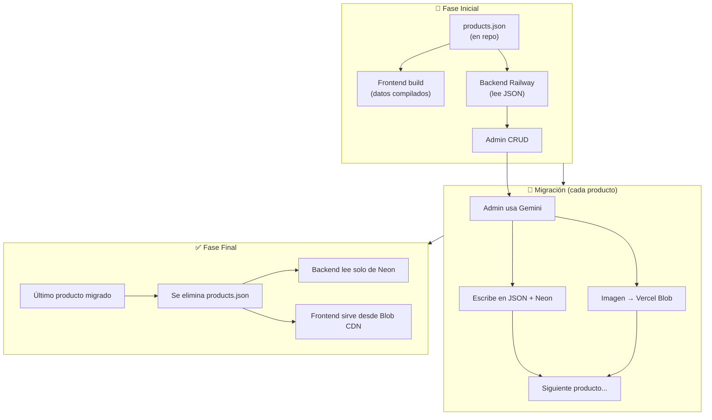

# Plan de Deployment Híbrido: JSON → Neon (Migración Natural)

> **Nota:** El proyecto usa **npm workspaces** (`package.json` raíz).
> Los comandos se pueden ejecutar desde la raíz con `npm run <script>` o en cada workspace con `npm run <script> -w <workspace>`.

## Estrategia General

Los productos inician en **JSON** (dentro del repo, compilados en el build estático del frontend). Cuando cada producto pase por el admin (Gemini), **se migra individualmente** a Neon + Vercel Blob. El JSON persiste hasta que el último producto sea migrado.

```
Fase Inicial:          JSON (repo) → Frontend build → Visitante ve productos
                       JSON (repo) → Backend Railway → Admin CRUD

Cuando un producto     Admin edita con Gemini
pasa por Gemini:       ├── Producto se escribe en JSON + Neon
                       ├── Imagen se migra a Vercel Blob
                       └── URL de imagen se actualiza

Fase Final:            Todos los productos en Neon + Blob
                       ├── Se elimina products.json del repo
                       └── Backend routes leen solo de Neon
```

---

## 🤖 Lo que implemento yo (Código) — Pasos 1-5

### Paso 1: Backend routes — Híbrido JSON + Neon

**Archivos a modificar:**

| Archivo | Cambio |
|---------|--------|
| [`backend/src/routes/products.ts`](backend/src/routes/products.ts) | GET lee de JSON. POST/PUT/DELETE escribe en JSON + hace upsert en Neon |
| [`backend/src/routes/categories.ts`](backend/src/routes/categories.ts) | Ídem |
| [`backend/src/routes/shipping-config.ts`](backend/src/routes/shipping-config.ts) | Ídem |

**Lógica híbrida:**
```typescript
// POST /api/products (ejemplo conceptual)
async function crearProducto(req, res) {
  // 1. Escribe en JSON (funcionamiento actual)
  const nuevoProducto = escribirEnJson(req.body);

  // 2. También escribe en Neon (para migración gradual)
  await db.insert(products).values(nuevoProducto);

  // 3. Responde
  res.status(201).json(nuevoProducto);
}
```

- GET conserva la lectura de JSON (compatible con funcionamiento actual)
- POST/PUT/DELETE escriben en **ambos**: JSON + Neon
- Cuando un producto existe en Neon, se marca como `migrated: true` (o similar) en JSON
- Si todos los productos están migrados, GET puede cambiar a leer de Neon

### Paso 2: Images route — Multer + Vercel Blob

**Archivo a modificar:** [`backend/src/routes/images.ts`](backend/src/routes/images.ts)

**Cambio:** `multer.diskStorage` local → `multer.memoryStorage` + subir a Vercel Blob

```typescript
// Flujo nuevo para upload de imágenes
router.post('/upload', upload.single('image'), async (req, res) => {
  const buffer = req.file.buffer;

  // Subir a Vercel Blob (cloud, persistente)
  const blob = await put(req.file.originalname, buffer, {
    access: 'public',
    addRandomSuffix: true,
  });

  res.json({ url: blob.url, /* ... */ });
});
```

Además, cuando el admin use **Gemini** en un producto existente (con imagen local), el sistema:
1. Detecta que la imagen es local (empieza con `assets/`)
2. La lee del filesystem y la sube a Vercel Blob
3. Actualiza la URL del producto en JSON + Neon

### Paso 3: Crear seed.ts — Poblar Neon con datos iniciales

**Archivo nuevo:** [`backend/src/seed.ts`](backend/src/seed.ts)

- Lee `products.json` y `categories.json`
- Inserta en Neon vía Drizzle
- Solo inserta si NO existen ya (evita duplicados en migración gradual)
- Se ejecuta una sola vez al inicio

### Paso 4: Ejecutar migración Drizzle + Seed

```bash
cd backend
npx drizzle-kit generate   # Genera SQL de tablas
npx drizzle-kit migrate    # Crea tablas en Neon
npx tsx src/seed.ts        # Puebla datos iniciales
```

### Paso 5: AdminApiService + Conectar Frontend

**Archivo nuevo:** [`frontend/src/app/core/services/admin-api.service.ts`](frontend/src/app/core/services/admin-api.service.ts)

Servicio HTTP para que el admin Angular se comunique con Railway:
- `getProducts()`, `createProduct()`, `updateProduct()`, `deleteProduct()`
- `generateContent(images, category)` → Gemini
- `uploadImage(file)` → Vercel Blob

**Archivos a modificar:**
- [`frontend/src/app/admin/product-form/product-form.component.ts`](frontend/src/app/admin/product-form/product-form.component.ts): usar `AdminApiService` en lugar de `ProductService` local
- [`frontend/src/app/admin/shipping-config/shipping-config.component.ts`](frontend/src/app/admin/shipping-config/shipping-config.component.ts): conectar a API

---

## 🧑 Lo que haces tú (Configuración) — Pasos 6-9

### Paso 6: Railway + Neon

1. Ir a [railway.app](https://railway.app)
2. Crear nuevo proyecto → "Deploy from GitHub repo" (o `railway up`)
3. Root directory: `backend/`
4. Agregar **Neon PostgreSQL** add-on (automáticamente provee `DATABASE_URL`)
5. Configurar en Railway Dashboard → Variables:

| Variable | Valor | Ejemplo |
|----------|-------|---------|
| `DATABASE_URL` | (Autogenerada por Neon add-on) | `postgresql://...` |
| `GEMINI_API_KEY` | Tu API key de Google Gemini | `AIza...` |
| `BLOB_READ_WRITE_TOKEN` | De Vercel Blob (paso 7) | `vercel_blob_rw_...` |
| `CORS_ORIGIN` | URL de Vercel frontend | `https://aak-artesanias.vercel.app` |
| `PORT` | 3000 | `3000` |

### Paso 7: Vercel Blob Storage

1. Ir a [vercel.com](https://vercel.com) → **Storage** → **Create** → **Blob**
2. Elegir plan Hobby (gratuito)
3. Copiar el **`BLOB_READ_WRITE_TOKEN`**
4. Pegarlo en Railway Secrets (Paso 6)

### Paso 8: Deploy Frontend en Vercel

1. Ir a [vercel.com](https://vercel.com) → **Add New** → **Project**
2. Importar el repositorio de GitHub
3. **Root Directory:** `frontend/`
4. **Framework Preset:** Angular
5. **Build Command:** `npm run build`
6. **Output Directory:** `dist/AakArtesanias`
7. **Install Command:** `npm ci`
8. Deploy

### Paso 9: Finalizar Conexión

1. Railway te dará una URL como `https://backend-production-xxxx.up.railway.app`
2. Vercel te dará una URL como `https://aak-artesanias.vercel.app`
3. En Railway Dashboard → Variables, actualizar:
   - `CORS_ORIGIN = https://aak-artesanias.vercel.app`
4. En `AdminApiService`, configurar:
   - `baseUrl = https://backend-production-xxxx.up.railway.app/api`

---

## Diagrama de la Migración Natural



---

## 📦 Estructura Monorepo (npm Workspaces)

El proyecto ahora usa **npm workspaces** con un [`package.json`](package.json) raíz:

```
📁 AakOnline/                          ← Monorepo root
├── 📄 package.json                    ← npm workspaces: ["backend", "frontend"]
│
├── 📁 backend/                        ← "aak-artesanias-backend"
│   ├── 📄 package.json                ← Express + Drizzle + Neon
│   ├── 📁 src/                        ← API routes, schema, servicios
│   └── 📁 shared/                     ← Modelos compartidos + seed data
│
├── 📁 frontend/                       ← "aak-artesanias"
│   ├── 📄 package.json                ← Angular 22 + Tailwind
│   └── 📁 src/                        ← App, componentes, assets
│
├── 📁 config/                         ← Configuración compartida
├── 📁 plans/                          ← Documentación de arquitectura
└── 📁 utilities/                      ← Scripts auxiliares
```

### Comandos desde la raíz

| Comando | Descripción |
|---------|-------------|
| `npm run dev:backend` | Inicia backend en modo dev (tsx watch) |
| `npm run dev:frontend` | Inicia frontend Angular (ng serve) |
| `npm run build:backend` | Compila backend (tsc) |
| `npm run build:frontend` | Compila frontend (ng build) |
| `npm run db:generate` | Genera migraciones Drizzle |
| `npm run db:migrate` | Ejecuta migraciones en Neon |
| `npm run seed` | Puebla Neon con datos iniciales |
| `npm install` | Instala dependencias de todos los workspaces |

### Independencia total

- **Vercel** despliega solo `frontend/` → ignora el monorepo
- **Railway** despliega solo `backend/` → ignora el monorepo
- Cada workspace puede tener dependencias duplicadas sin problema
- El monorepo es solo para desarrollo local y scripts compartidos

---

## Resumen de Archivos a Crear/Modificar

### Archivos nuevos
| Archivo | Propósito |
|---------|-----------|
| [`package.json`](package.json) | Raíz del monorepo con npm workspaces |
| [`backend/src/seed.ts`](backend/src/seed.ts) | Poblar Neon con datos iniciales desde JSON |

### Archivos a modificar
| Archivo | Cambio |
|---------|--------|
| [`backend/src/routes/products.ts`](backend/src/routes/products.ts) | GET de JSON, POST/PUT/DELETE en JSON + Neon |
| [`backend/src/routes/categories.ts`](backend/src/routes/categories.ts) | GET de JSON, POST/PUT/DELETE en JSON + Neon |
| [`backend/src/routes/shipping-config.ts`](backend/src/routes/shipping-config.ts) | GET de JSON, PUT en JSON + Neon |
| [`backend/src/routes/images.ts`](backend/src/routes/images.ts) | multer memoryStorage → Vercel Blob |
| [`backend/src/routes/ai-content.ts`](backend/src/routes/ai-content.ts) | Migración natural de imágenes a Blob vía Gemini |

### No requirieron cambios (ya implementados)
| Archivo | Estado |
|---------|--------|
| [`frontend/src/app/core/services/admin-api.service.ts`](frontend/src/app/core/services/admin-api.service.ts) | ✅ Ya existía con todos los endpoints |
| [`frontend/src/app/admin/product-form/product-form.component.ts`](frontend/src/app/admin/product-form/product-form.component.ts) | ✅ Ya usaba AdminApiService + Gemini + upload |
| [`frontend/src/app/admin/shipping-config/shipping-config.component.ts`](frontend/src/app/admin/shipping-config/shipping-config.component.ts) | ✅ Ya usaba AdminApiService con fallback local |
