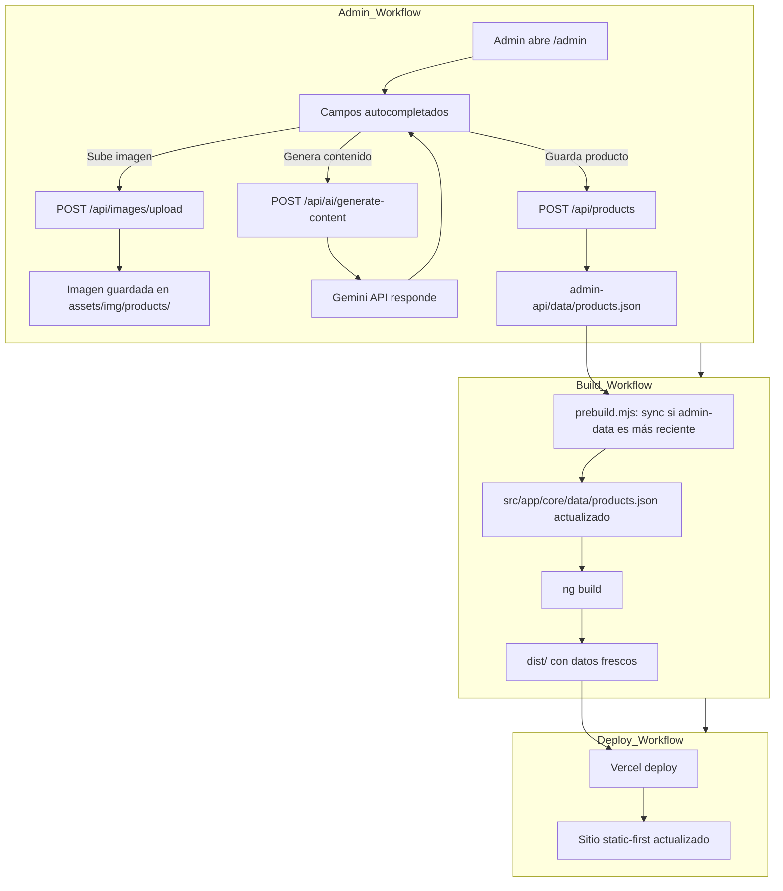
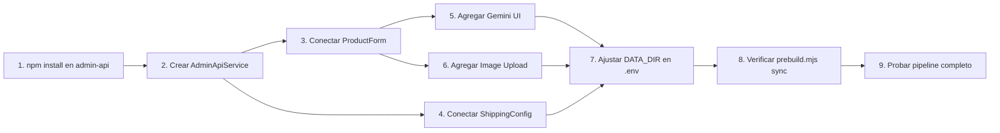

# Plan de Implementación — Fase 7: Admin API Completion

## Objetivo

Cerrar la brecha entre el frontend admin (Angular) y el backend `admin-api` (Express), completando el pipeline static-first: Admin → API → JSON → prebuild → ng build → Vercel deploy.

---

## Estado Actual vs. Estado Deseado

```
ANTES: Admin Angular → ProductService (memoria) → se pierde al recargar
DESPUÉS: Admin Angular → HTTP fetch → admin-api → products.json (disco)
                                              → prebuild.mjs sync
                                              → ng build compila datos frescos
```

---

## 1. Instalar dependencias de admin-api

**Archivo:** [`admin-api/`](AakArtesanias/admin-api/)

| Tarea | Comando | Detalle |
|-------|---------|---------|
| Instalar | `cd admin-api && npm install` | Express, multer, @google/generative-ai, dotenv, cors |
| Crear .env | Copiar `.env.example` → `.env` | GEMINI_API_KEY placeholder |
| Verificar | `npm run dev` | Servidor debe iniciar en puerto 3000 |

---

## 2. Crear AdminApiService (frontend)

**Archivo nuevo:** [`AakArtesanias/src/app/core/services/admin-api.service.ts`](AakArtesanias/src/app/core/services/admin-api.service.ts)

Servicio Angular que envía HTTP requests a `admin-api`. Se inyecta en los componentes admin en lugar del `ProductService` local.

### Endpoints a implementar

```typescript
@Injectable({ providedIn: 'root' })
export class AdminApiService {
  private baseUrl = 'http://localhost:3000/api';

  // Productos
  getProducts(): Promise<Product[]>;
  getProduct(id: number): Promise<Product>;
  createProduct(data: Partial<Product>): Promise<Product>;
  updateProduct(id: number, data: Partial<Product>): Promise<Product>;
  deleteProduct(id: number): Promise<void>;

  // Categorías
  getCategories(): Promise<Category[]>;
  updateCategory(id: number, data: Partial<Category>): Promise<Category>;

  // Gemini
  generateContent(images: string[], categoryName: string): Promise<GeminiResult>;

  // Imágenes
  uploadImage(file: File): Promise<{ url: string }>;
}
```

### Dependencias
- Usar `fetch` nativo (no necesita HttpClient de Angular)
- Tipos `GeminiResult` y endpoints definidos en el mismo archivo

---

## 3. Conectar ProductForm a AdminApiService

**Archivo a modificar:** [`AakArtesanias/src/app/admin/product-form/product-form.component.ts`](AakArtesanias/src/app/admin/product-form/product-form.component.ts)

### Cambios

| Actual (ProductService local) | Nuevo (AdminApiService) |
|-------------------------------|------------------------|
| `inject(ProductService)` | `inject(AdminApiService)` |
| `productService.addProduct()` | `adminApi.createProduct()` |
| `productService.updateProduct()` | `adminApi.updateProduct()` |
| Datos en memoria volátil | Datos persistidos en JSON vía API |
| No hay feedback visual | Loading state + toast de éxito/error |

### Flujo nuevo

```
submit form
  → adminApi.createProduct(data)
    → POST /api/products
      → admin-api escribe products.json
    → Response 201
  → Mostrar toast "Producto creado"
  → Emitir saved event
```

---

## 4. Agregar botón "Generar con Gemini" en ProductForm

**Archivo a modificar:** [`AakArtesanias/src/app/admin/product-form/product-form.component.ts`](AakArtesanias/src/app/admin/product-form/product-form.component.ts)

### UI

```
[Input imagen URL]  [Seleccionar archivo]  [Subir imagen]
                                                 ↓
[Botón: ✨ Generar con Gemini]  (solo si hay imagen)
         ↓ (loading spinner mientras genera)
[Campos autocompletados: nombre, shortDescription,
 longDescription, marketingPhrase]
```

### Flujo Gemini

```
1. Usuario sube/pega URL de imagen
2. Clic "Generar con Gemini"
3. adminApi.generateContent([imagen], categoryName)
   → POST /api/ai/generate-content
   → Gemini analiza imagen + genera contenido
4. Response autocompleta los campos del formulario
5. Usuario edita si es necesario
6. Usuario guarda → POST /api/products
```

### Template (nuevo bloque en el form)

```html
<!-- Gemini Section -->
<div class="md:col-span-2 border-t pt-4 mt-4">
  <div class="flex items-center gap-3">
    <button type="button"
            (click)="generateWithGemini()"
            [disabled]="isGenerating || !formState.image"
            class="px-4 py-2 bg-gradient-to-r from-purple-600 to-amber-500
                   text-white font-medium rounded-lg hover:opacity-90
                   disabled:opacity-50 disabled:cursor-not-allowed
                   transition-all cursor-pointer">
      @if (isGenerating) {
        ⏳ Generando...
      } @else {
        ✨ Generar con Gemini
      }
    </button>
    @if (isGenerating) {
      <span class="text-sm text-gray-500">Analizando imagen...</span>
    }
  </div>
</div>
```

---

## 5. Agregar Image Upload en ProductForm

**Archivo a modificar:** [`AakArtesanias/src/app/admin/product-form/product-form.component.ts`](AakArtesanias/src/app/admin/product-form/product-form.component.ts)

### UI

```html
<div class="md:col-span-2">
  <label class="block text-sm font-medium text-gray-700 dark:text-gray-300 mb-1">
    Imagen del producto
  </label>
  <div class="flex items-center gap-3">
    <input type="file" (change)="onFileSelected($event)"
           accept="image/jpeg,image/png,image/webp"
           class="block w-full text-sm text-gray-500 file:mr-4 file:py-2 file:px-4
                  file:rounded-lg file:border-0 file:text-sm file:font-medium
                  file:bg-amber-50 file:text-amber-700 hover:file:bg-amber-100
                  dark:file:bg-gray-700 dark:file:text-gray-300" />
    @if (isUploading) {
      <span class="text-sm text-gray-500">Subiendo...</span>
    }
  </div>
  @if (formState.image) {
    
  }
</div>
```

### Lógica

```typescript
async onFileSelected(event: Event): Promise<void> {
  const file = (event.target as HTMLInputElement).files?.[0];
  if (!file) return;
  this.isUploading = true;
  try {
    const result = await this.adminApi.uploadImage(file);
    this.formState.image = result.url;
  } catch (err) {
    console.error('Upload failed:', err);
  } finally {
    this.isUploading = false;
  }
}
```

---

## 6. Hacer ShippingConfig editable

**Archivo a modificar:** [`AakArtesanias/src/app/admin/shipping-config/shipping-config.component.ts`](AakArtesanias/src/app/admin/shipping-config/shipping-config.component.ts)

### Cambios

| Actual | Nuevo |
|--------|-------|
| Solo lectura | Celdas editables (input type="number") |
| Datos de ShippingService local | Datos vía AdminApiService |
| Sin guardar | Botón "Guardar cambios" por categoría |

### Template

```html
@for (tier of config.tiers; track tier.minKm) {
  <tr>
    <td><input [(ngModel)]="tier.minKm" type="number" class="..."/></td>
    <td><input [(ngModel)]="tier.maxKm" type="number" class="..."/></td>
    <td><input [(ngModel)]="tier.price" type="number" class="..."/></td>
  </tr>
}
<button (click)="saveConfig(config)">💾 Guardar</button>
```

---

## 7. Actualizar prebuild.mjs para sincronizar bidireccional

**Archivo a modificar:** [`AakArtesanias/utilities/prebuild.mjs`](AakArtesanias/utilities/prebuild.mjs)

Actualmente solo copia `admin-api/data/ → src/app/core/data/` si admin-data es más reciente.

### Mejora

```javascript
// Si admin-data/products.json existe, reemplaza al de frontend data/
// Esto asegura que el build compile los datos más recientes del admin
```

Ya está implementado, pero hay que verificar que `admin-api/data/` exista como directorio. Actualmente el CRUD de admin-api escribe directamente a `../src/app/core/data/products.json` (según `DATA_DIR` en `.env`).

**Opción recomendada:** Cambiar default de `DATA_DIR` para que admin-api escriba en su propio directorio `admin-api/data/`, y el prebuild sincronice hacia el frontend.

```
.env:
  DATA_DIR=./data          # admin-api escribe en admin-api/data/
  
prebuild.mjs:
  admin-api/data/ ──sync──→ src/app/core/data/  (si admin-data es más reciente)
```

---

## 8. Pipeline completo



---

## 9. Dependencias y orden de ejecución



---

## 10. Resumen de archivos a crear/modificar

### Archivos nuevos
| Archivo | Propósito |
|---------|-----------|
| [`AakArtesanias/src/app/core/services/admin-api.service.ts`](AakArtesanias/src/app/core/services/admin-api.service.ts) | Servicio HTTP para conectar con admin-api |

### Archivos a modificar
| Archivo | Cambio |
|---------|--------|
| [`AakArtesanias/admin-api/.env`](AakArtesanias/admin-api/.env.example) | Crear desde .env.example, ajustar DATA_DIR=./data |
| [`AakArtesanias/admin-api/src/routes/categories.ts`](AakArtesanias/admin-api/src/routes/categories.ts) | Agregar POST para crear categorías |
| [`AakArtesanias/src/app/admin/product-form/product-form.component.ts`](AakArtesanias/src/app/admin/product-form/product-form.component.ts) | Cambiar ProductService → AdminApiService, agregar Gemini UI, image upload |
| [`AakArtesanias/src/app/admin/shipping-config/shipping-config.component.ts`](AakArtesanias/src/app/admin/shipping-config/shipping-config.component.ts) | Hacer editable, conectar a AdminApiService |
| [`AakArtesanias/utilities/prebuild.mjs`](AakArtesanias/utilities/prebuild.mjs) | Verificar DATA_DIR point correcto |
