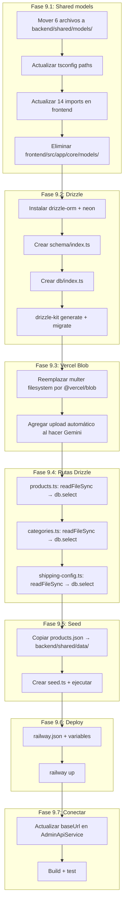

# Plan de Migración: Railway + Neon + Drizzle + Vercel Blob

## Principios de diseño

1. **Single source of truth** — Los modelos viven en UN solo lugar: `backend/shared/models/`
2. **Backend autocontenido** — Railway construye desde `backend/` (package.json, tsconfig, railway.json)
3. **Frontend referencia externa** — Angular importa modelos desde `backend/shared/models/` vía tsconfig paths
4. **Vercel Blob para imágenes** — Las imágenes se almacenan en Vercel Blob (no en el repo ni en Railway filesystem)
5. **Migración natural** — No hay script de migración masiva; las imágenes se migran a Blob cuando cada producto pasa por el admin/Gemini

---

## Estructura final

```
📁 Aak_versiones/
│
├── 📁 backend/                          ← Railway (autocontenido)
│   ├── 📁 shared/                       ← Single source of truth
│   │   ├── 📁 models/                   ← MOVED desde frontend
│   │   │   ├── product.model.ts
│   │   │   ├── category.model.ts
│   │   │   ├── quote.model.ts
│   │   │   ├── session.model.ts
│   │   │   ├── shipping-config.model.ts
│   │   │   └── category-lookup.model.ts
│   │   └── 📁 data/                     ← Seed data for Neon
│   │       └── products.json
│   │
│   ├── 📁 src/
│   │   ├── index.ts
│   │   ├── 📁 routes/
│   │   │   ├── products.ts              ← Drizzle en vez de JSON
│   │   │   ├── categories.ts            ← Drizzle en vez de JSON
│   │   │   ├── ai-content.ts
│   │   │   ├── images.ts                ← @vercel/blob en vez de multer
│   │   │   └── shipping-config.ts       ← Drizzle en vez de JSON
│   │   ├── 📁 db/
│   │   │   └── index.ts                 ← Conexión Drizzle + Neon
│   │   └── 📁 schema/
│   │       └── index.ts                 ← Drizzle schema
│   │
│   ├── 📁 drizzle/
│   ├── drizzle.config.ts
│   ├── package.json
│   ├── tsconfig.json                    ← paths: "@shared/*" → ["./shared/*"]
│   ├── .env
│   └── railway.json
│
├── 📁 AakArtesanias/                    ← Vercel
│   ├── src/app/core/
│   │   └── 📁 models/                   ← ❌ ELIMINAR
│   ├── src/assets/img/products/         ← Se conserva (imágenes existentes)
│   ├── tsconfig.json                    ← paths: "@shared/*" → ["../backend/shared/*"]
│   └── (sin cambios)
│
├── 📁 config/
├── 📁 plans/
└── 📁 utilities/
```

---

## Fase 9.1: Mover modelos a backend/shared/models/

### Archivos a mover (6)

| Desde (frontend) | Hacia (backend) |
|---|---|
| `AakArtesanias/src/app/core/models/product.model.ts` | `backend/shared/models/product.model.ts` |
| `AakArtesanias/src/app/core/models/category.model.ts` | `backend/shared/models/category.model.ts` |
| `AakArtesanias/src/app/core/models/quote.model.ts` | `backend/shared/models/quote.model.ts` |
| `AakArtesanias/src/app/core/models/session.model.ts` | `backend/shared/models/session.model.ts` |
| `AakArtesanias/src/app/core/models/shipping-config.model.ts` | `backend/shared/models/shipping-config.model.ts` |
| `AakArtesanias/src/app/core/models/category-lookup.model.ts` | `backend/shared/models/category-lookup.model.ts` |

### Frontend: path mapping en tsconfig

```json
// AakArtesanias/tsconfig.json
{
  "compilerOptions": {
    "baseUrl": ".",
    "paths": {
      "@shared/models/*": ["../backend/shared/models/*"]
    }
  }
}
```

### 14 archivos frontend a actualizar

Cada import `'../../core/models/foo.model'` → `'@shared/models/foo.model'`

| Archivo | Cambio |
|---|---|
| `core/services/product.service.ts` | `'../models/product.model'` → `'@shared/models/product.model'` |
| `core/services/category.service.ts` | `'../models/category.model'` → `'@shared/models/category.model'` |
| `core/services/quote.service.ts` | `'../models/quote.model'` → `'@shared/models/quote.model'` |
| `core/services/shipping.service.ts` | `'../models/shipping-config.model'` → `'@shared/models/shipping-config.model'` |
| `core/services/pdf.service.ts` | `'../models/quote.model'` → `'@shared/models/quote.model'` |
| `core/services/admin-api.service.ts` | `'../models/product.model'` (×3) → `'@shared/models/...'` |
| `admin/dashboard/dashboard.component.ts` | `'../../core/models/...'` → `'@shared/models/...'` |
| `admin/shipping-config/shipping-config.component.ts` | `'../../core/models/...'` → `'@shared/models/...'` |
| `admin/product-form/product-form.component.ts` | `'../../core/models/...'` → `'@shared/models/...'` |
| `admin/catalog-workspace/catalog-workspace.component.ts` | `'../../core/models/...'` → `'@shared/models/...'` |
| `shared/variant-selector/variant-selector.component.ts` | `'../../core/models/...'` → `'@shared/models/...'` |
| `shared/quick-actions/quick-actions.component.ts` | `'../../core/models/...'` → `'@shared/models/...'` |
| `shared/product-card/product-card.component.ts` | `'../../core/models/...'` → `'@shared/models/...'` |
| `shared/navbar/navbar.component.ts` | `'../../core/models/...'` → `'@shared/models/...'` |

---

## Fase 9.2: Drizzle ORM + Neon

### Schema Drizzle

```typescript
// backend/src/schema/index.ts
import { pgTable, serial, integer, text, doublePrecision, jsonb, timestamp } from 'drizzle-orm/pg-core';

export const products = pgTable('products', {
  id: serial('id').primaryKey(),
  sku: text('sku').notNull(),
  categoryId: integer('category_id').notNull(),
  name: text('name'),
  slug: text('slug').notNull(),
  image: text('image').notNull().default(''),      // ← URL de Vercel Blob o ruta local
  imageList: jsonb('image_list').default([]),         // ← array de URLs Blob
  variantSelections: jsonb('variant_selections'),
  originalPrice: doublePrecision('original_price').default(0),
  currentPrice: doublePrecision('current_price').default(0),
  shippingComponents: jsonb('shipping_components'),
  taggedSection: text('tagged_section'),
  featuredImage: text('featured_image').default(''),
  featureTag: text('feature_tag').default(''),
  tags: jsonb('tags').default([]),
  score: doublePrecision('score').default(0),
  ratings: integer('ratings').default(0),
  shortDescription: text('short_description').default(''),
  longDescription: text('long_description').default(''),
  marketingPhrase: text('marketing_phrase').default(''),
  status: text('status').default('pendiente'),
  createdAt: timestamp('created_at').defaultNow(),
  updatedAt: timestamp('updated_at').defaultNow(),
});
```

### Conexión Neon

```typescript
// backend/src/db/index.ts
import { drizzle } from 'drizzle-orm/neon-http';
import { neon } from '@neondatabase/serverless';
import * as schema from '../schema/index.js';

const sql = neon(process.env.DATABASE_URL!);
export const db = drizzle(sql, { schema });
```

---

## Fase 9.3: Vercel Blob para imágenes

### Reemplazar multer por @vercel/blob

```typescript
// backend/src/routes/images.ts
import { put, del } from '@vercel/blob';
import { Router } from 'express';
import multer from 'multer';

const router = Router();
const upload = multer({ storage: multer.memoryStorage(), limits: { fileSize: 10 * 1024 * 1024 } });

// POST /api/images/upload
// Sube a Vercel Blob y devuelve URL pública
router.post('/upload', upload.single('image'), async (req, res) => {
  if (!req.file) return res.status(400).json({ error: 'No file uploaded' });

  const blob = await put(req.file.originalname, req.file.buffer, {
    access: 'public',
    addRandomSuffix: true,
  });

  res.json({ url: blob.url, filename: blob.pathname, size: req.file.size });
});

// DELETE /api/images/delete
// Elimina de Vercel Blob
router.delete('/delete', async (req, res) => {
  const { url } = req.body;
  if (!url?.startsWith('https://')) return res.status(400).json({ error: 'Invalid URL' });
  await del(url);
  res.json({ success: true });
});

export default router;
```

### ¿Migrar las 81 imágenes existentes? No es necesario.

**Decisión: Migración natural, no forzada.**

| Estrategia | Qué pasa | Veredicto |
|---|---|---|
| **A. Migración natural** (elegida) | Las imágenes actuales quedan en `assets/img/products/` (servidas por Vercel). Cuando admin edita un producto y usa Gemini, el sistema sube la imagen a Blob y actualiza la URL. | ✅ Sin script. Sin riesgo. Migración progresiva. |
| **B. Bulk migration** | Script que sube las 81 imágenes a Blob y actualiza la DB. | ❌ Innecesario. Las imágenes actuales ya funcionan desde el repo. |
| **C. Forzar en Gemini** | Al hacer clic en "✨ Generar con Gemini", el sistema automáticamente sube la imagen actual a Blob antes de enviarla a Gemini. | ✅ Se integra con el flujo natural de admin. |

La estrategia es:

```
1. Producto nuevo → admin sube imagen → Vercel Blob → URL guardada en Neon
2. Producto existente (con imagen local) → admin edita → clic "✨ Gemini"
   → Sistema detecta que la imagen es local (empieza con "assets/")
   → La sube automáticamente a Vercel Blob
   → Usa la URL de Blob para enviar a Gemini
   → Guarda producto con URL de Blob en Neon
3. Producto existente (nunca editado) → sigue funcionando con ruta local desde el repo
   → Frontend sirve ambas: assets/img/... (repo) y blob.vercel-storage.com/... (Blob)
```

**Esto significa:** No necesitas un script de migración. Cada producto se migrará individualmente cuando pase por el admin. Los productos que nunca se editen seguirán funcionando con sus rutas locales.

---

## Fase 9.4: Reescribir rutas JSON → Drizzle

| Ruta actual (JSON) | Nueva (Drizzle) |
|---|---|
| `readFileSync + writeFileSync` | `db.select().from(products)` |
| `findIndex + write` | `db.update(products).set(...).where(eq(...))` |
| `filter + write` | `db.delete(products).where(eq(...))` |

---

## Fase 9.5: Seed inicial a Neon

```typescript
// backend/src/seed.ts
// Lee backend/shared/data/products.json (copia del JSON actual)
// Para cada producto, inserta en Neon via Drizzle
// Las rutas de imagen locales (assets/img/...) se conservan tal cual
// El frontend las resuelve desde el repo hasta que sean migradas a Blob
```

---

## Fase 9.6: Configurar Railway + Vercel Blob

### railway.json

```json
{
  "build": {
    "builder": "NIXPACKS",
    "buildCommand": "npm install && npm run build"
  }
}
```

### Variables de entorno

| Variable | Valor | Dónde se configura |
|---|---|---|
| `DATABASE_URL` | `postgresql://...` | Neon add-on (automático en Railway) |
| `GEMINI_API_KEY` | `AIza...` | Railway Secrets |
| `BLOB_READ_WRITE_TOKEN` | `vercel_blob_rw_...` | Railway Secrets (generado en Vercel → Storage → Blob) |
| `CORS_ORIGIN` | `https://aak-artesanias.vercel.app` | Railway Variables |
| `UPLOAD_DIR` | `./uploads` | Railway Variables (temporal, para multer buffer) |

### Cómo obtener BLOB_READ_WRITE_TOKEN

```
1. Ir a https://vercel.com → Storage → Create → Blob
2. Copiar el BLOB_READ_WRITE_TOKEN
3. Agregarlo como Secret en Railway Dashboard
```

---

## Fase 9.7: Conectar frontend

### AdminApiService apunta a Railway

```typescript
// AakArtesanias/src/app/core/services/admin-api.service.ts
private baseUrl = 'https://backend-production-xxxx.up.railway.app/api';
```

### Frontend sirve imágenes de dos fuentes

El frontend no necesita cambios. Las imágenes se muestran con ``:

- Si es URL de Blob (`https://*.public.blob.vercel-storage.com/*`) → se carga de la CDN
- Si es ruta local (`assets/img/products/...`) → se carga del repo (Vercel las sirve como static assets)

Ambos casos funcionan sin modificar el template.

---

## Costos

| Servicio | Plan | Costo |
|---|---|---|
| Railway | Starter | ~$5/mes |
| Neon | Free | $0 |
| Vercel (frontend) | Hobby | $0 |
| Vercel Blob | Hobby (250 MB, 1M req/mes) | $0 |
| Gemini API | Free (60 req/min) | $0 |
| **Total** | | **~$5/mes** |

---

## Orden de ejecución


