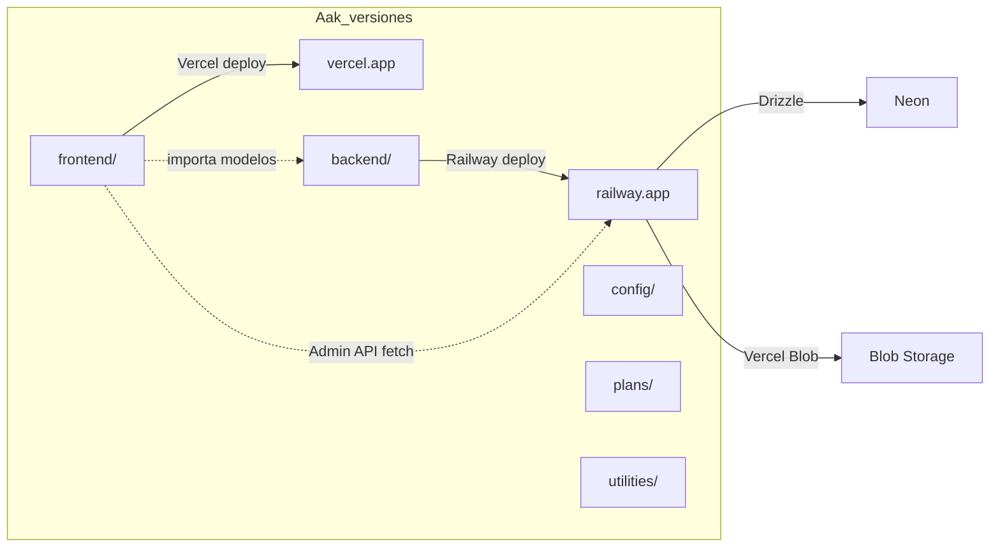

# Plan: Renombrar AakArtesanias → frontend

## Objetivo

Renombrar el directorio `AakArtesanias/` a `frontend/` para que la estructura final sea:

```
📁 Aak_versiones/
├── 📁 frontend/            ← antes era AakArtesanias/
├── 📁 backend/             ← el backend separado
├── 📁 config/
├── 📁 plans/
└── 📁 utilities/
```

---

## Impacto del rename

### ✅ No requiere cambios

| Ítem | Razón |
|---|---|
| `frontend/tsconfig.json` paths `@shared/models/*` → `["../backend/shared/models/*"]` | Ruta relativa, funciona igual desde `frontend/` |
| `frontend/src/app/core/services/admin-api.service.ts` `baseUrl` | Se configura después del deploy, independiente del nombre |
| `backend/` | No referencia a `AakArtesanias/` por nombre |
| `config/` | No referencia a `AakArtesanias/` por nombre |
| Imports `@shared/models/...` | Path mapping resuelve por ruta relativa, no por nombre |

### ⚠️ Requiere cambios

| Archivo | Cambio necesario |
|---|---|
| [`.vscode/settings.json`](AakArtesanias/.vscode/) | Si existe, puede tener paths absolutos |
| [`Furnixar_AakApp.code-workspace`](Furnixar_AakApp.code-workspace) | Actualizar ruta del folder |
| [`ParamoAndAakArtesanias.code-workspace`](ParamoAndAakArtesanias.code-workspace) | Actualizar ruta del folder |
| [`checkpoint.md`](checkpoint.md) | Actualizar referencias a `AakArtesanias/` |
| [`utilities/prebuild.mjs`](AakArtesanias/utilities/prebuild.mjs) | Usa rutas relativas dentro del proyecto, no debería afectar |
| Vercel project settings | Cambiar Root Directory de `AakArtesanias` a `frontend` |

---

## Pasos

### 1. Renombrar el directorio

```bash
# Desde Aak_versiones/
ren AakArtesanias frontend
```

### 2. Actualizar workspace files

Buscar cualquier referencia a `"AakArtesanias"` en los archivos `.code-workspace` y reemplazar por `"frontend"`.

### 3. Actualizar checkpoint.md

Reemplazar todas las ocurrencias de `AakArtesanias/` por `frontend/`.

### 4. Verificar build

```bash
cd frontend
npm run build
```

### 5. Actualizar Vercel

En Vercel dashboard → Project Settings → Root Directory:
- Antes: `AakArtesanias`
- Después: `frontend`

### 6. Railway no requiere cambios

Railway ya apunta a `backend/` como root directory, no se ve afectado.

---

## Riesgos

| Riesgo | Mitigación |
|---|---|
| Git no trackea renames de carpetas | `git add -A` captura el rename como delete + add |
| Paths absolutos en scripts | Buscar con `grep -r "AakArtesanias" .` antes de renombrar |
| CI/CD pipelines rotos | Actualizar root directory en Vercel y Railway |

---

## Después del rename


